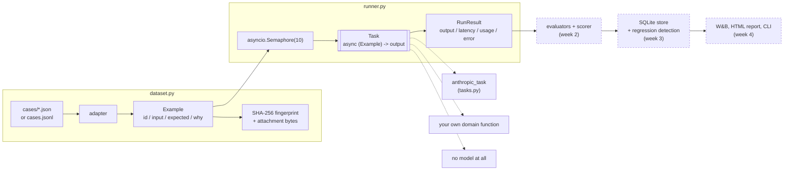

# llm-evalkit

A Python library for evaluating LLM outputs at scale. Loads and fingerprints a dataset, runs whatever is under evaluation across it concurrently, scores the results with pluggable evaluators, and reports a mean with a bootstrap confidence interval around it — so "73%" comes with the range that says whether it differs from last week's 71%.

It is a library, not a service. `pip install`, import it, run it against your own code. Nothing to deploy, nothing in anyone's request path.

## Status

**Week 1 of 4 — `0.1.0.dev0`, not yet released.** Datasets and the runner work and are tested. Evaluators, scoring, storage, regression detection, W&B and the HTML report are the next three phases and are not built yet; the `evalkit` command currently exposes only `datasets`.

## Where this came from

It was extracted, not invented. [Navi](https://github.com/kevinreber/navi) — a planning-orchestrator agent — had grown three hand-rolled eval runners totalling 939 lines, and each one re-implemented the same loop: load cases, call the thing under test, score, print a scorecard. The generic half of that loop is this package. The domain half stays in Navi as evaluator callables.

That origin is why the interfaces look the way they do. The three suites disagree about almost everything an eval framework normally assumes, and the interface had to bend to fit all three rather than the other way round:

| | `extraction` | `suggestions` | `notes` |
|---|---|---|---|
| what it calls | a domain function that owns its own prompt and model | a pure ranking function | nothing — the artifact was harvested from production |
| what comes back | a Pydantic model | an ordered list of ids | already in the input file |
| what a score is | six field scores plus an invention **count** | a list of labelled pass/fail **checks** | several rates, each of which can be **not applicable** |
| labels | hand-corrected gold | relational assertions (`A outranks B`) | none at all |
| cost per run | real API spend | free | free |

A framework built around `(prompt) -> str` and `expected == actual` serves one of those three.

## Why not Braintrust, LangSmith, or promptfoo?

Fair question, and the honest answer is **use them for the suite that fits**. This is not a claim that the incumbents are bad; it is a claim about shape, and it was measured rather than assumed.

The extraction suite was ported to Braintrust before this package went any further. It reproduced the hand-rolled scorecard almost exactly — 25 real cases against the live API in 60 seconds:

| Field | Braintrust port | hand-rolled runner |
|---|---|---|
| kind | 88.0% | 88% |
| price_tier | 88.0% | 88% |
| duration | 96.0% | 100% |
| locations | 73.8% | 73% |
| activities | 90.8% | 89.8% |
| season_months | 89.9% | 89.9% |
| **overall** | **87.7%** | **88.1%** |
| inventions | 3 | 3 |

Every gap is inside the ±1-field run-to-run wobble that suite already documents. For a conventional eval, a hosted platform wins on the thing that matters most — clicking into a failing example and diffing two runs is where eval insight actually comes from, and this package will not beat that.

Then the same port was attempted for the ranking suite, which asserts *relative ordering over a whole result set* ("A outranks B", "X is filtered out", "this reference's best window lands in October"), and where the assertions differ from case to case. Across 16 cases and 10 check kinds, **only 25% of the scorer/row grid was applicable** — 120 of 160 cells not-applicable, with three metrics computed from a single case each. A mean over n=1 is not a metric.

To be precise about what did *not* go wrong: Braintrust handles `None` from a scorer correctly, so not-applicable is respected rather than counted as zero. The issue is not correctness. It is that a platform which names its scorers once for the whole dataset and means them has no natural home for "this case is red, and here is the design decision you broke."

So the split is:

- **Conventional evals** — one prompt, one response, compare to an answer: use a hosted platform. You will get a better UI than this for free.
- **Deterministic, relational, or unlabeled suites** — property-based regression tests over a ranker, or scorecards over artifacts harvested from production: those are what this is for.
- **Data you would rather not egress** — harvested production traffic with real user content is a decision, not a shrug.

One thing found in the process, which is its own argument: porting the eval forced it to run against the real API with a key present, and that surfaced two live bugs in the consuming project — an unpinned SDK that would have broken ingest on the next deploy, and an eval that had been silently scoring a heuristic fallback and reporting it as a real number. An eval that cannot tell *"the model got worse"* from *"I never called the model"* is worse than no eval, because it answers with a number either way. Most of the design decisions below exist to make that class of failure impossible.

## How it works



## Quickstart

```python
import asyncio
from anthropic import AsyncAnthropic
from llm_evalkit import ModelPricing, anthropic_task, load_jsonl, run

dataset = load_jsonl("datasets/qa.jsonl")
task = anthropic_task(
    AsyncAnthropic(),
    model="claude-haiku-4-5-20251001",
    system="Answer in one word.",
    pricing={"claude-haiku-4-5-20251001": ModelPricing(input_per_mtok=1.0, output_per_mtok=5.0)},
)

result = asyncio.run(run(dataset, task, concurrency=10))
print(f"{len(result.succeeded)}/{len(result)} ok, ${result.known_cost_usd:.4f}")
```

Evaluating something that isn't a model call is the same code with a different task:

```python
async def rank(example):
    return my_ranker(example.input["references"], example.input["window"])

result = asyncio.run(run(load_dir("evals/suggestions/cases"), rank))
```

Inspect a dataset from the shell:

```
evalkit datasets evals/extraction/cases
```

## Design decisions worth knowing

- **The unit of work is a task, not a model call.** `async (Example) -> output`. The runner never touches an SDK. This is what lets a suite with no model at all — a deterministic ranker, or a scorecard over artifacts harvested from production — get the concurrency cap, the failure isolation and the timing for free, with no API key and no spend. `anthropic_task` is one implementation of the interface, in its own module, not the runner's body.

- **`None` is not zero, in either direction.** A plan that recorded no notes has no orphan-note rate; averaging it in as `0.0` would report a *better* score for a planner that did nothing. Likewise an unpriced model's cost is recorded as unknown rather than free, and a run reports `known_cost_usd` alongside `unpriced_results` so the total reads as the floor it is. Costs should only ever be wrong in the expensive direction.

- **The fingerprint hashes attachment contents, not attachment paths.** An extraction case points at a screenshot beside it on disk. Hashing only the JSON leaves the fingerprint unchanged when the image behind it is swapped — precisely the silent drift a fingerprint exists to catch. It also excludes absolute paths, so two machines agree.

- **Datasets declare whether they are expected to hold still.** A `golden` set changes only when a human edits it, so a fingerprint mismatch means two runs measured different things and the comparison should be refused. A `harvested` set is re-sampled from production every time it is collected, so its fingerprint always differs — refusing that comparison would make an organic suite permanently incomparable to itself. Week 3's regression detection reads this flag.

- **Drafts do not score.** A case file ending `.draft.json` is excluded by default. Bootstrapping a gold set by pre-filling the model's own output as the expected labels is roughly ten times faster than authoring JSON by hand — and rubber-stamping it blesses today's bugs as correct. The rename is the human's signature.

- **Running and scoring are separate passes.** Results carry raw outputs, so a scoring change can be re-applied without paying the model twice.

- **One bad example cannot abort a run.** A 500-example run that dies on example 3 has spent real money and produced nothing. Failures are captured onto their own result, results come back in dataset order regardless of completion order, and a broken progress callback is logged rather than allowed to replace a result that was already paid for.

- **The console script is `evalkit`, not `eval`.** `eval` is a builtin in bash and zsh; the shell would swallow the command before it reached the package.

- **`temperature` defaults to 0.** An eval that samples at the provider default measures the model *and* the sampler, then attributes the resulting wobble to whatever changed between runs.

## Roadmap

| Phase | Contents | State |
|---|---|---|
| 1 | `dataset.py`, `runner.py`, `tasks.py` | done |
| 2 | evaluator protocol + `Score`, **bootstrap confidence intervals**, aggregation | done |
| 2 (cont.) | exact / regex / LLM-judge / embedding evaluators, judge position-bias measurement | done |
| 1 (cont.) | retry with backoff on 429/5xx, pre-flight cost estimation with confirm-on-threshold | next |
| 3 | `Store` protocol + SQLite, regression detection, refuse cross-fingerprint comparison | |
| 4 | W&B runs, `run` / `compare` / `report` / `datasets` CLI, Jinja2 HTML report, PyPI `0.1.0` | |

The non-negotiable one is bootstrap CI. Without it an eval score is noise dressed as signal: 73% against 71% on 100 examples is meaningless when the 95% interval is `[68%, 80%]` for both.

That is not hypothetical here. Running Navi's real 25-case extraction suite through this package reproduces its recorded scorecard exactly — and attaches the interval its hand-rolled runner never could:

```
  activities        87.9%   CI [0.820, 0.933]
  locations         74.7%   CI [0.621, 0.855]
  ...
  overall           88.1%   CI [0.838, 0.921]
  inventions           2
```

The interval is **8.3 percentage points wide**. So the 88.1% recorded a month earlier and the 87.7% measured on a different SDK version are not two results — they are the same result twice, and no amount of staring at the decimals would have said so.

### Measured: LLM-judge position bias, and why the usual measurement is wrong

The standard advice is to measure a judge's position bias by presenting each pair as (A, B) and again as (B, A), then counting flips. Run against **claude-sonnet-5** on 16 deliberately near-tied pairs, that gave:

```
  DISAGREEMENT RATE           25.0%      <- first run
  DISAGREEMENT RATE            0.0%      <- second run, identical experiment
```

The same experiment produced 25% and then 0%. Neither number means anything, and the reason is the control almost nobody runs — judging the **same pair in the same order twice**:

```
  CONTROL: same order twice   31.2%      <- nondeterminism floor
  excess attributable to slot     ~0%
```

The judge disagrees with *itself* about a third of the time on near-tied pairs. So the swap-disagreement never exceeds the noise floor, and on this judge and these pairs there is **no detectable position bias** — the naive measurement would have reported 25% of one and been wrong.

Which raises the obvious fix, temperature 0. That is no longer available: `anthropic` 1.0.0 removed `temperature` from the typed signature of both `messages.create()` and `messages.parse()`, and the API answers `400 — temperature is deprecated for this model` for newer models including claude-sonnet-5. Routing it through `extra_body` reaches the wire and gets the same 400.

So `measure_position_bias()` runs the control **by default**, `PositionBias.excess_over_noise` is the number to read, and an uncontrolled measurement prints `UNCONTROLLED — not interpretable on its own` rather than a figure someone might quote. A measurement that looks rigorous while being confounded is worse than no measurement.

### Known limitation: usage is invisible through a wrapped task

The task seam is what lets a domain function keep its own prompt, but the cost of that is that the framework cannot see inside it. A task that calls `anthropic_task` reports tokens and cost; a task that calls *your* function, which calls a model internally, reports none — the run above shows `$0.0000` despite spending real money inside Navi's normalizer. That is honest rather than wrong (no usage was reported to it, so it claims none), but it means pre-flight cost estimation will only cover tasks the framework itself issues.

## Development

```bash
uv sync --all-extras --dev
uv run pytest
uv run ruff check src tests
```

The test suite runs entirely against a fake client. No API key, no spend, no network — which is what makes it repeatable and what lets it run in CI, unlike the suites this package was extracted from.

## License

MIT
